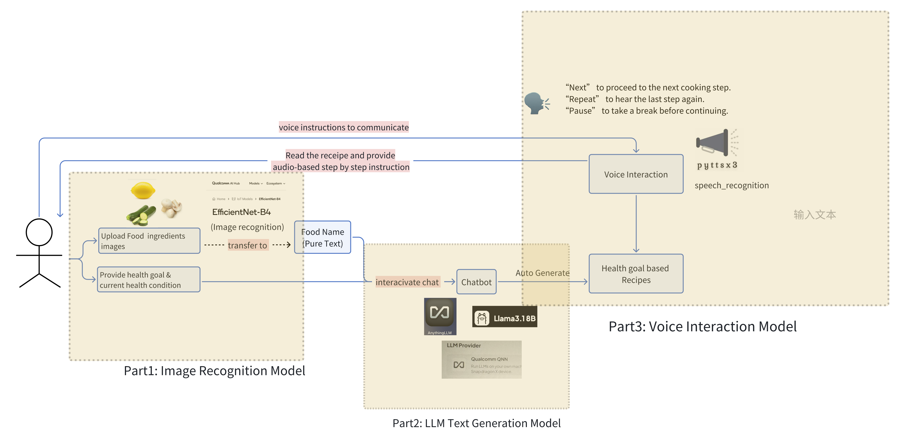

# Hackathon Project - *AIronChef*

Submitted by: **Five Golden Flowers**

**AIronChef** is an AI-powered meal assistant that leverages edge computing to help users plan meals and cook with voice guidance. By combining LLM technology with image recognition, AIronChef can suggest personalized recipes based on available ingredients and dietary restrictions, while providing hands-free cooking instructions.
 
## 🔹 Project Background & Motivation 

Cooking is an essential part of daily life, but meal planning and preparation can be challenging, especially for individuals with specific dietary needs such as diabetes management or weight control. 
Many people struggle with deciding what to cook based on the ingredients they have, often leading to food waste or unbalanced diets. Additionally, following a recipe while cooking can be inconvenient, as users frequently need to check their phone screens with their hands occupied.

Current solutions, such as online recipe platforms and meal planning apps, provide static recommendations based on user input but lack personalization and real-time guidance. Existing voice assistants, while useful, are often not optimized for step-by-step cooking instructions, making them less effective in a kitchen setting.
This project aims to address these gaps by creating an AI-powered meal assistant that not only suggests recipes based on available ingredients but also provides real-time voice-guided cooking instructions. By incorporating LLM technology, the assistant will have a human-like personality, offering companionship and support throughout the cooking process. This personalized AI can cater to specific dietary needs while making the cooking experience more convenient and engaging, as well as helping users to stick to healthy recipes more easily.

### Application flow


## 👥 Team Members  
- **Brenda Jow** ([LinkedIn](https://www.linkedin.com/in/brendajow/)) - Developer  
- **Esther Chen** ([LinkedIn](https://www.linkedin.com/in/esther-chen-seattle)) - Developer 
- **Tzu-Chieh Yang** ([LinkedIn](https://www.linkedin.com/in/tzu-chieh-yang-221149290)) - Developer
- **Zhen Zhen** ([Email](mailto:zhenzhenzz0318@gmail.com)) - Developer
- **Zhiliang Yu** ([Email](mailto:zellayu1212@gmail.com)) - Developer


## 🌟 Features

- [ ] **Computer Vision Ingredient Analysis** - Users can upload images of the food items in their refrigerator, and AIronChef will analyze the available ingredients using computer vision.
- [ ] **AI-Powered Recipe Suggestions** - Based on the analyzed ingredients and dietary restrictions, the system will generate personalized recipe suggestions.
- [ ] **Health-Focused Chatbot** - Users can chat with an AI-powered chatbot to discuss their health concerns, dietary needs, and meal planning.
- [ ] **Automated Grocery List Generation** - AIronChef can generate a shopping list based on missing ingredients needed for suggested recipes.
- [ ] **Recipe Receipt Generation** - The chatbot will provide users with a digital receipt, including nutritional information and recommended meals to help maintain a balanced diet.


## 🚀 Setup Instructions

This README will guide you through setting up the project on your local computer. It includes the creation of a virtual environment, installation of dependencies, and troubleshooting steps.

## Prerequisites

Ensure that you have the following installed on your local machine:

- Python 3.x
- pip (Python's package manager)
- PowerShell (for Windows users)
- Terminal or Bash (for macOS/Linux users)

## Steps to Set Up the Project

### SetupLLM

1. Install and setup [AnythingLLM](https://anythingllm.com/).
    * Choose Qualcomm QNN when prompted to choose an LLM provider to target the NPU
    * Choose a model of your choice when prompted. This sample uses __Llama 3.1 8B Chat with 8K context__
2. Create a workspace by clicking "+ New Workspace"
3. Generate an API key
    * Click the settings button on the bottom of the left panel
    * Open the "Tools" dropdown
    * Click "Developer API"
    * Click "Generate New API Key"


### 1. Clone the Repository

Clone the repository to your local machine using the following command:

```bash
git clone <repository-url>
```

### 2. Create a Virtual Environment

Navigate to the project directory and create a virtual environment to isolate your project dependencies:
```
cd <repository-folder>
```

#### For Windows (PowerShell):

```powershell
python -m venv llm-venv
```

#### For macOS/Linux (Terminal):

```bash
python -m venv llm-venv
```

This will create a new virtual environment called `llm-venv`.

### 3. Activate the Virtual Environment

#### For Windows (PowerShell):

```powershell
.\llm-venv\Scripts\Activate.ps1
```

#### For macOS/Linux (Terminal):

```bash
source llm-venv/bin/activate
```

You should now see `(llm-venv)` in your terminal, indicating that the virtual environment is active.

### 4. Install Dependencies

Install the necessary Python packages by using the `requirements.txt` file. This file contains all the packages required for the project:

```bash
pip install -r requirements.txt
```

*Note:* If you haven't already installed the `opencv-python` and `onnxruntime` libraries, you can manually install them by running:

```bash
pip install opencv-python onnxruntime
```

### 5. Check for Missing Files

You might encounter errors if certain files are missing. For example, the `config.yaml` file was not found initially. You can manually create the `config.yaml` file in the project directory with the following format:

```yaml
api_key: "your-apikey"
model_server_base_url: "http://localhost:3001/api/v1"
workspace_slug: "your-slug"
```

If you already have this file in another location, you can copy it into the project directory:

#### For Windows (PowerShell):

```powershell
Copy-Item -Path C:\path\to\config.yaml -Destination .
```

#### For macOS/Linux (Terminal):

```bash
cp /path/to/config.yaml .
```

### 6. Running the Code

This will launch the chatbot in interactive mode, allowing you to chat with the AI assistant.

```bash
python src/main.py
```

### 7. Usage

| Command	| Function      |
|-------------|---------------|
|classify images {image file path}	| The bot will analyze the provided image, extract ingredients, and generate a healthy recipe based on the user's health condition. |
| Provide health condition	| The user must enter their current health condition (e.g., "I have diabetes" or "I need a low-carb meal"), so the bot can generate a personalized meal plan. |
| exit or quit	| Terminates the chatbot session.| 


```
$ python src/main.py
You: Hello!
Bot: Hi! How can I assist you today?

You: classify images ./images/fruit_salad.jpg
Bot: Analyzing the image...
Bot: Ingredients detected: Banana, Apple, Orange
Bot: Please provide your health condition to generate a suitable recipe.

You: I have high blood pressure.
Bot: Based on your health condition, here is a recommended healthy meal:
     - Low-sodium fruit salad with yogurt
     - Add flaxseeds for extra fiber and omega-3
     - Avoid adding processed sugar

You: quit
Bot: Exiting chatbot. Have a great day!

```

This should start the chatbot, and you should be able to interact with it.

### 8. Troubleshooting

- **Qualcomm QNN Runtime Missing**

On a Snapdragon X Elite machine, Qualcomm QNN should be the default LLM Provider. If you do not see Qualcomm QNN as an option on the dropdown, you downloaded the AMD64 version of AnythingLLM. Delete the app and install the ARM64 version instead.

- **ModuleNotFoundError**: If you encounter an error like `ModuleNotFoundError: No module named 'requests'`, make sure that the virtual environment is activated and that all dependencies are installed by running:

  ```bash
  pip install -r requirements.txt
  ```

- **Missing `config.yaml`**: If the script asks for the `config.yaml` file, ensure it is manually created with the format provided in Step 5.

- **PowerShell Execution Policy (Windows Only)**: If you get an error when activating the virtual environment in PowerShell, you might need to adjust your execution policy. Run the following command in PowerShell as Administrator:

  ```powershell
  Set-ExecutionPolicy -ExecutionPolicy RemoteSigned -Scope CurrentUser
  ```

This will allow you to run the script.

- **Checking Python Version and Path**: If you encounter issues with running Python scripts, confirm that you are using the correct Python version and virtual environment:

### For Windows (PowerShell):

```powershell
python3 --version
where python3
```

### For macOS/Linux (Terminal):

```bash
python3 --version
which python3
```

---

Now your environment should be set up and running! You can start interacting with the chatbot or work on other features of the project.


## 📄 License

- This project is licensed under the MIT License - see the LICENSE file for details.


## 🔗 References

